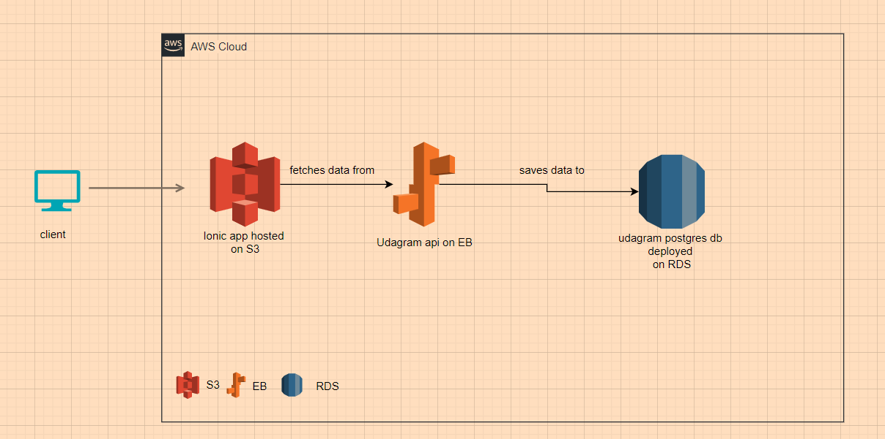

# Udagram infrastructure

## Database (RDS)

The database is hosted on RDS (Postgres)
<a href="udagram.cnykrrqre5ry.us-east-1.rds.amazonaws.com
">Link</a>

## S3

The frontend application is hosted on AWS S3 Bucket.

Here is the hosted application on <a href="http://udagram-meska.s3-website-us-east-1.amazonaws.com">S3 Bucket</a>

## Elastic Beanstalk

The Server API is deployed on AWS Elastic Beanstalk (EB)

Here is a link to <a href="http://udagramapi-env.eba-zgwzx6cp.us-east-1.elasticbeanstalk.com/">Udagram API</a>
