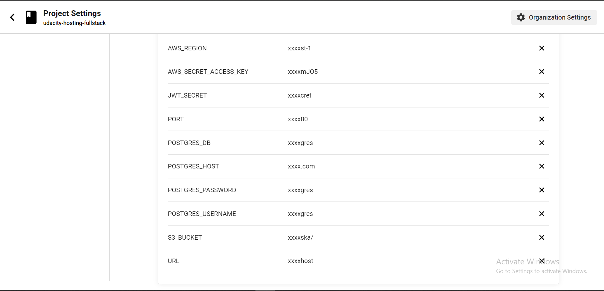

# Cicrleci Pipeline

when users push to the main branch, this will trigger circleci to build and deploy the frontend and backend
the frontend is deployed to s3 bucket, and backend is deployed to elasticbeanstalk instance

## Circle Build

## Circleci enviroment

